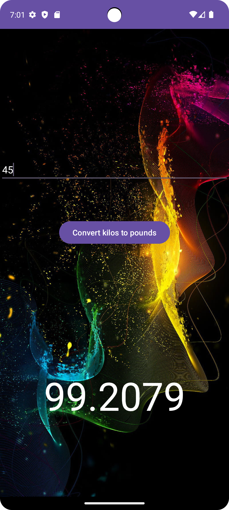

# 📏 Unit Converter App

A simple, intuitive, and responsive Unit Converter built to help users convert values across multiple measurement units in weights.

---

## 🚀 Features

- ✅ Clean and user-friendly interface
- 🔁 Real-time unit conversion
- 📱 Responsive design (mobile support)
- 🌐 Supports various weight categories
- 🗂️ Organized and scalable codebase

---

## 🛠️ Tech Stack

| Tech | Description |
|------|-------------|
|  Java  | Language  |
| Jetpack Compose | UI Framework |
| Clean Architecture | Architecture Pattern |
| LocalStorage | persistence |

---

## 📸 Screenshots

> screenshots to showcase the app  
> Example:
> 

---

## 🧪 Installation & Usage

### 💻 Local Setup

1. **Clone the repository**
   ```bash
   git clone https://github.com/ALAN-K-BIJU/unit-converter-app.git
   cd unit-converter-app
